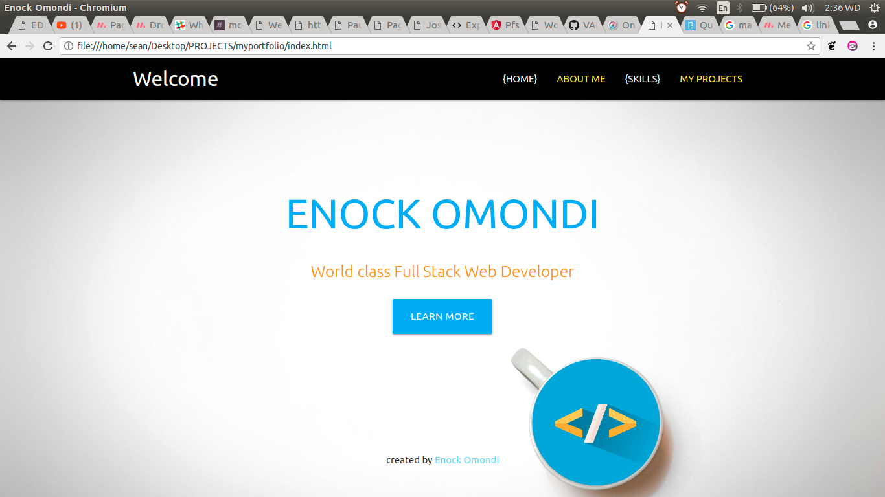

# PORTFOLIO

## CONTRIBUTORS
  1. Garvin Bersek
  2. collins Muiruri
  3. raymond Okwenda

## DESCRIPTION
  This is my portfolio

  ### Specs
    1. Introduction to myself.(about secton)
    2. My level of experience.(languages section)
    3. Highlights some of my projects.(projects section)

## COMPLETE SETUP/INSTALLATION
### Tech used
  1. HTML
  2. CSS(The use of bootstrap CDN will require user to have an internet connection).
  3. MATIRIALIZE CSS(first time using this, wanted to learn somthing new).
  4. jQuery-3.2.1 library.
  5. Atom
## LICENSE INFORMATION AND COPY RIGHT
  [MIT License](enock omondi)
